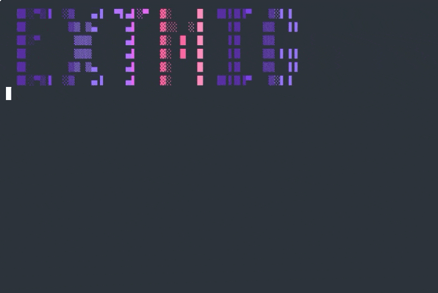

# extmig

> Scan, compare, and synchronize extensions across VS Code-based IDEs and JetBrains IDEs

[](https://opensource.org/licenses/MIT)
[](https://www.typescriptlang.org/)
[](https://nodejs.org/)

---

## What is extmig?

- CLI tool for scanning, comparing, and syncing IDE extensions
- Supports VS Code-based IDEs talking to each other (same extension ID space)
- Supports JetBrains → VS Code migration (different ID spaces, auto-translated)
- Dry-run by default — nothing installs until you explicitly say so

---

## Demo



---

## Why does this exist?

- VS Code and Cursor use **Microsoft Marketplace**; VSCodium, Code-OSS, AntiGravity use **Open VSX** — not every extension exists on both
- JetBrains plugins use a completely different format (`META-INF/plugin.xml`, reverse-domain IDs) with no direct equivalent mapping to VS Code extensions
- No single tool previously handled scanning, availability checks, diffing, and installing across these boundaries

---

## Supported IDEs

### VS Code-based

| IDE                | Identifier    | Default Marketplace |
| ------------------ | ------------- | ------------------- |
| Visual Studio Code | `vscode`      | vscode              |
| Cursor             | `cursor`      | vscode              |
| VSCodium           | `vscodium`    | openvsx             |
| Code - OSS         | `code-oss`    | openvsx             |
| AntiGravity        | `antigravity` | openvsx             |

### JetBrains

| IDE            | Identifier      | Notes            |
| -------------- | --------------- | ---------------- |
| IntelliJ IDEA  | `intellij`      | Scan source only |
| Android Studio | `androidstudio` | Scan source only |

- Versioned config directories (e.g. `IntelliJIdea2024.3/plugins/`) are resolved automatically — latest version is picked

---

## Supported Marketplaces

| Marketplace           | Identifier  | Role                   |
| --------------------- | ----------- | ---------------------- |
| Microsoft Marketplace | `vscode`    | Query + install target |
| Open VSX Registry     | `openvsx`   | Query + install target |
| JetBrains (local)     | `jetbrains` | Scan source only       |

---

## Core principles

- **CLI-first** — scriptable, composable, automation-friendly
- **Dry-run by default** — `sync` simulates before it touches anything
- **Stateless** — every run scans fresh; no local cache to go stale
- **Non-invasive** — relies only on official IDE CLIs and filesystem inspection
- **Explainable** — every extension's status is reported explicitly
- **Cross-platform** — macOS, Linux, Windows

---

## Getting started

- Node.js >= 18 and npm required

```bash
git clone <repo-url>
cd extmig
npm install
npm run build
```

Run directly:

```bash
node bin/extmig.js <command> [options]
```

Or link globally to use the `extmig` shortcut:

```bash
npm link
extmig <command> [options]
# npm unlink to remove later
```

---

## Usage

Run Interactive mode with this command (recommended)

```bash
extmig
```

### List detected IDEs

- Scans the system for all supported IDEs
- Reports installed IDEs with version and CLI path

```bash
extmig list
```

---

### Scan an IDE

- Lists all extensions/plugins installed in an IDE
- Supports `--json` for machine-readable output
- Reads both unpacked directories and `.jar` files for JetBrains

```bash
extmig scan <ide>
extmig scan vscode
extmig scan intellij
extmig scan --json vscode
```

---

### Compare two IDEs (diff)

- Shows extensions only in source, only in target, and in both
- Flags version mismatches
- Marketplace defaults to the target IDE's native one — override with `--marketplace`
- JetBrains source adds a cross-IDE resolution section (see [below](#cross-ide-migration-jetbrains--vs-code))

```bash
extmig diff <source> <target>
extmig diff antigravity vscode
extmig diff intellij vscode
extmig diff --json cursor vscodium
```

---

### Sync extensions

- Installs extensions into the target IDE via its CLI
- Dry-run by default — use `--no-dry-run` to actually install
- JetBrains source: only auto-matched plugins are synced; "needs review" and "no equivalent" are listed but skipped

```bash
extmig sync <source> <target>
extmig sync antigravity vscode                                    # dry run
extmig sync antigravity vscode --no-dry-run                       # install
extmig sync cursor vscode --no-dry-run --concurrency 5 --force
extmig sync intellij vscode --no-dry-run
```

#### Sync flags

| Flag                       | Default         | Description                                  |
| -------------------------- | --------------- | -------------------------------------------- |
| `--no-dry-run`             | dry-run on      | Actually run installations                   |
| `-c, --concurrency <n>`    | 3               | Parallel installations                       |
| `-f, --force`              | off             | Reinstall even if already present            |
| `--no-skip-unavailable`    | skip on         | Fail if any extension is unavailable         |
| `-m, --marketplace <type>` | target's native | Override marketplace for availability checks |

---

### Export extensions

- Writes the installed extension list to a JSON file
- Defaults to `<ide>-extensions.json`

```bash
extmig export <ide>
extmig export vscode
extmig export intellij --output ij.json
extmig export vscode --no-pretty
```

---

### Import extensions

- Reads a JSON file and installs extensions into the target IDE
- Dry-run by default
- File only requires an `extensions` array with `id` fields; everything else is optional

```bash
extmig import <file> <target>
extmig import vscode-extensions.json vscode
extmig import ij.json cursor --no-dry-run
```

```json
{
  "extensions": [
    { "id": "esbenp.prettier-vscode", "version": "10.0.0" },
    { "id": "dbaeok.eslintrc" }
  ]
}
```

---

## Cross-IDE migration: JetBrains → VS Code

- Well-known plugin pairs (Prettier, ESLint, EditorConfig, Docker, etc.) are mapped via a static table and confirmed on the target marketplace
- Unknown plugins are searched by display name on the target marketplace:
  - 0 results → **no equivalent**
  - 1 result → **auto-matched**
  - 2+ results → **needs review** (candidates listed for you to install manually)
- Only auto-matched plugins appear in the syncable diff; the rest are reported but never installed automatically

---

## Limitations

- JetBrains is scan-only — migration direction is JetBrains → VS Code-based only
- "Needs review" plugins require manual install via `code --install-extension <id>`
- Marketplace availability is checked at diff time, not install time — failures are reported gracefully
- Only the highest-version JetBrains config directory is scanned per IDE

---

## Quick-start cheat sheet

```bash
# See what's installed where
extmig list
extmig scan vscode

# Preview what a migration would do
extmig diff cursor vscode
extmig diff intellij vscode

# Run the migration (dry-run first, then for real)
extmig sync cursor vscode
extmig sync cursor vscode --no-dry-run

# Back up and restore
extmig export vscode
extmig import vscode-extensions.json cursor --no-dry-run
```
